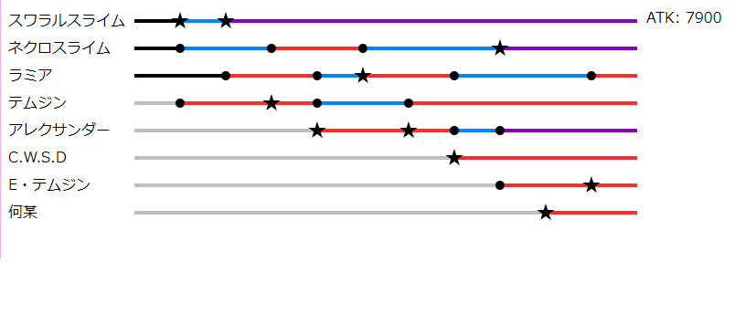
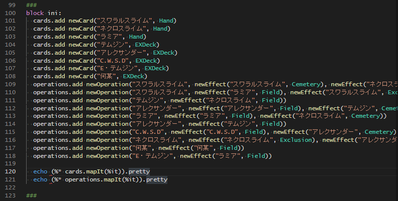

# YGOeditor

遊戯王のコンボを表記/管理


## quick start
1. generate index.js from index.nim
    ```
    nim js index
    ```
2. open index.html on browser

## 編集
1. index.nimの↓を編集

     - カード編集
        ```
        cards.add newCard("<カード名>", <初期位置>)
        ```
     - 処理編集
        ```
        operations.add newOperation(
                          "<カード名>",
                          newEffect("<カード名>", <位置>),
                          newEffect("<カード名>", <位置>),
                          ...)
        ```


## Goals
実装予定
- A: 着手中
  - コンボを編集
  - jsonファイルにエクスポート
- B: 設計中
  - 手札から展開可能なコンボを表示
- C: 構想中
  - デッキをインポート
  - インポートしたデッキからコンボ生成